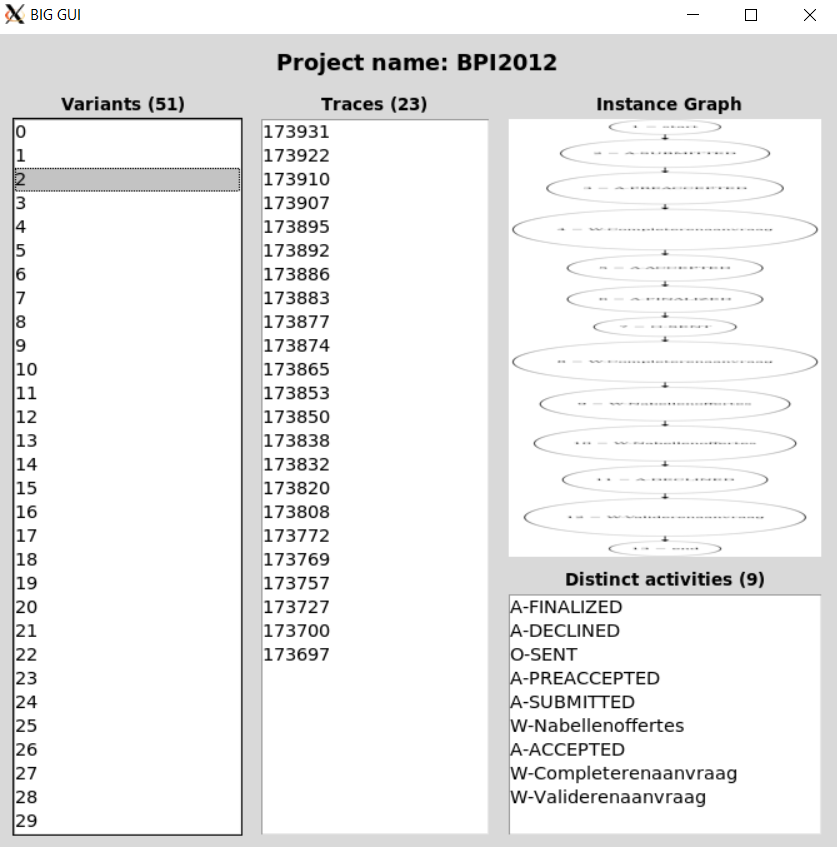

# A Graphical User Interface for the Spark implementation of the Building Instance Graph (BIG) algorithm for the analysis of Big event logs


Nowadays, many companies have implemented information systems to track and facilitate the execution of various business processes. These systems, thanks to technological advances and increasing applications, produce a considerable amount of data stored in the form of event logs, which contain information about how various processes are executed. Processes can be described as a set of traces, which in turn contain events. Traces represent a single instance of the process while the events represent the activities performed for each trace.
The Building Instance Graph (BIG) algorithm builds instance graphs starting from the event log. BIG has been parallelized and distributed through Apache Spark. Using Spark, it was possible to partition the log file into individual trace and then run the algorithm for each of them, with the goal of enhancing performance.
The developed GUI allows to choose from a folder the dataset representing the processes, to execute the BIG algorithm and to obtain a graph representation  of the trace based on the model of the process taken in account. The whole software has been placed in a Docker container so as to allow easy installation and execution of the application.

## Docker
Docker is an open platform for developing, shipping, and running applications that provides the ability to package and run an application in a loosely isolated environment called a container.
Docker is used to encapsulate Hadoop, Spark and all other dependencies required to run the application.

You can download and install Docker on multiple platforms. Refer to the [link](https://docs.docker.com/get-docker/) and choose the best installation path for you. Then start Docker.

## X Window System 
The X Window System of the host is used for displaying all GUI elements. Docker containers are isolated from the host operating system in which they run. This means that they cannot access the graphical resources of the host system directly. Using X11, a connection can be created between the container and the X11 server on the host system, allowing the container to display the GUI on the host system's screen. Basically, the X11 server runs on the host system and the X11 client runs inside the docker container, allowing the GUI to be displayed.

### Windows
You could install Xming, a server X Window System for Microsoft Windows, from the [official website](https://sourceforge.net/projects/xming/).

To start the X11 server you must launch the Xming program through the appropriate icon (Start->Programs->Xming->Xming), or through its icon on the desktop if created during installation.

### MacOS
You could install XQuartz, an open source implementation of X11 for macOS, from the [officiale website](https://www.xquartz.org/). 

To start the X11 server, you need to know the IP address of the host machine. For that, in the XQuartz shell run the command:
```
$ ifconfig en0
```
and copy the IP address. 
Then run the command:
```
$ xhost "IP address"
```

to allow the IP address for X11.


### Linux
To use X11 on Linux, you could simply install the xorg-x11-server-Xorg package that provides the X server and the necessary libraries. 
Then run the command:
```
$ xhost +
```
to  allow any client to connect to the X server

## BUILD
First of all clone the repository with the command:
```
$ git clone https://github.com/a-mircoli/big-gui.git
```

Then to build the docker image on your computer, run the following command:
```
$ docker build -t big_gui big_gui
```

## RUN
If you want to add a dataset, create a folder in the path _"big_gui/app/BIG2/BIGDatasets"_. Then, inside this insert the file .xes and the net file (with the same name finish with _petriNet).

To run a container instance of the previously build docker image follow the instructions below.

### Windows
Run the command:
```
$ docker run -it --rm -e DISPLAY=host.docker.internal:0.0 -v /tmp/.X11-unix:/tmp/.X11-unix -v "%cd%"/big_gui/app:/home/jovyan/work big_gui
```

### MacOS
Run the command:
```
$ docker run -it --rm -e DISPLAY="IPaddress":0 -v /tmp/.X11-unix:/tmp/.X11-unix -v $(pwd)/big_gui/app:/home/jovyan/work big_gui
```
in which "IPaddress" is the IP address of the host machine found with the command _ifconfig en0_.

### Linux
Run the command:
```
$ docker run -it --rm --net=host -e DISPLAY -v /tmp/.X11-unix:/tmp/.X11-unix -v $(pwd)/big_gui/app:/home/jovyan/work big_gui
```
### Explaining container run options
- `-it` - allow the user to access and interact with the container prompt and send keyboard input to the container
- `--rm` - automatically remove container when it exits
- `-e DISPLAY` - sets the DISPLAY environment variable inside the container to the value of the X server's display number
- `-v /tmp/.X11-unix:/tmp/.X11-unix` - mounts the host's X11 socket directory into the container, allowing the container to access the host's X server
- `-v $(pwd)/big_gui/app:/home/jovyan/work` - map directory into docker container with read and write access

### Use case: building instance graphs from an event log
In order to build instance graphs from a new event log through BIG GUI, the following procedure should be followed:
1. open the application and click on the "+ Add new project" button;

2. insert the project title, which must be different from existing projects, and click on the "Browse" buttons of the "Log file" and the "Petri net (.pnml)" fields in order to respectively select the event log and the Petri net. Finally, click on the "Analyze" button;

3. the event log is analyzed and the BIG algorithm builds instance graphs. At the end of the analysis, the software shows a new window that contains information about the instance graphs and the variants to which they belong.
4. A single variant may be inspected by double-clicking on its identifier (i.e., a progressive number): the list of traces will update accordingly, as well as the total number of traces
5. By double-clicking on a trace, its instance graph and the list of its unique activities are shown. It is also possible to enlarge the instance graph by clicking on it.


### Video

